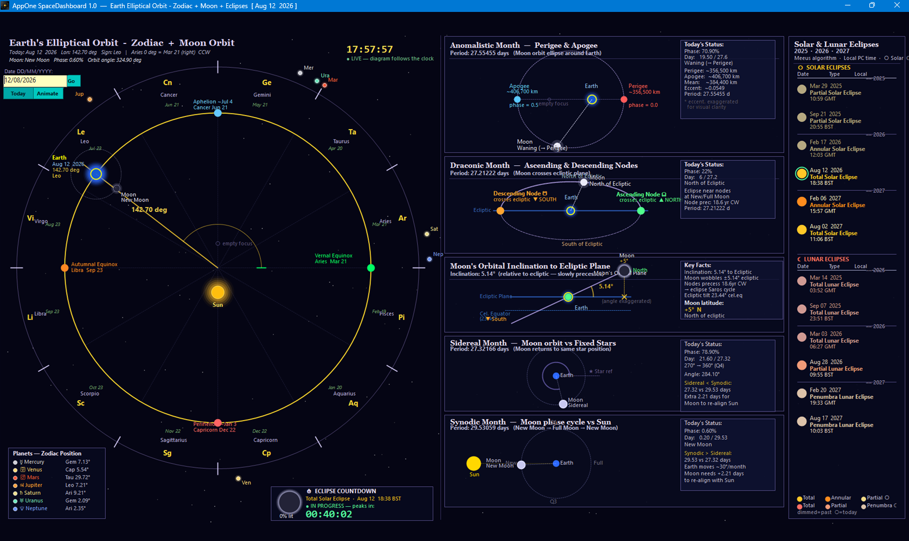

# AppOne SpaceDashboard 1.0

A C# WinForms astronomy dashboard for Windows — a full port of the Ring language
sample [`Earth_Orbit_Moon_Phases_Eclipses_Zodiac.ring`](https://github.com/ring-lang/ring/tree/master/samples/General/Orbital)
(by Bert Mariani), extended with planet positions and an Animate mode.



## What it shows

- **Main view** — Earth's elliptical orbit around the Sun (Sun at the bottom focus,
  major axis vertical, Aries 0° at right, counter-clockwise), the zodiac ring with
  glyphs/names/dates, equinox/solstice + perihelion/aphelion markers, today's Earth
  position with its ecliptic longitude arc, and the Moon orbiting Earth with a
  phase-correct shaded disc.
- **Anomalistic Month panel** (27.55455 d) — perigee/apogee ellipse with today's Moon.
- **Draconic Month panel** (27.21222 d) — ascending/descending nodes vs the ecliptic.
- **Inclination panel** — the Moon's 5.14° orbital tilt and today's ecliptic latitude.
- **Sidereal Month panel** (27.32166 d) — Moon orbit vs fixed stars.
- **Synodic Month panel** (29.53059 d) — Moon phase cycle vs the Sun.
- **Eclipse column** — all solar eclipses (Meeus algorithm) and lunar eclipses
  (full-moon refinement + umbra/penumbra geometry) for the current year ± 1,
  with past events dimmed and today's eclipse ringed in green. Times are converted
  from UT to the PC's Windows time zone, DST-aware per event — in the UK, winter
  events show GMT and summer events show BST; other zones show a GMT±offset label.
- **Planets legend** — heliocentric zodiac positions of Mercury→Neptune (Keplerian
  elements, true anomaly), drawn as dots just outside the zodiac ring.
- **Eclipse countdown + Moon face** — bottom-centre panel with a large phase-correct
  Moon disc (% illuminated) and a live countdown to the next eclipse: counts to its
  start, then to its peak, then to completion, then rolls to the following event.
  Start/end use an approximate window around greatest eclipse (±90 min solar,
  ±105 min lunar); the peak instant is exact.

## Controls

- **Date box + Go** (or press Enter) — show any date, `DD/MM/YYYY`. A non-today date
  puts `*** TEST DATE ***` in the title bar and pauses the live clock.
- **Today** — back to the real current date and time (live mode).
- **Animate** — advances one day per tick (~7 days/s); click again (**Stop**) to halt.
- **Live clock** — in today mode a clock ticks at the top of the canvas and the whole
  diagram (Earth, Moon, cycle panels, planets) is recomputed each second with the
  current time of day.
- The window is freely resizable/maximizable — the scene scales to fit.

## Build & run

Requires the .NET 9 SDK (Windows).

```
dotnet build -c Release
bin\Release\net9.0-windows\AppOneSpaceDashboard.exe
```

## Project layout

| File | Purpose |
|------|---------|
| `Astro.cs` | All astronomy math: date → ecliptic longitude, Moon cycles, Meeus solar eclipses, lunar eclipses, Keplerian planet positions |
| `Renderer.cs` | All GDI+ drawing: main scene, Moon phase disc, the five insert panels, eclipse column, planets legend |
| `MainForm.cs` | Window, date input, Go/Today/Animate buttons |
| `Program.cs` | Entry point |

## Notes

- Layout, colours and typography follow the original Ring/Qt code (1880×1020 canvas).
- Planet longitudes are computed from JPL approximate Keplerian elements solving
  Kepler's equation (true anomaly), so they can differ by a few degrees from the
  reference screenshot, which used mean longitudes (most visible for Mercury and Mars).
- Eclipse results match the reference app exactly (verified for 2025–2027).
